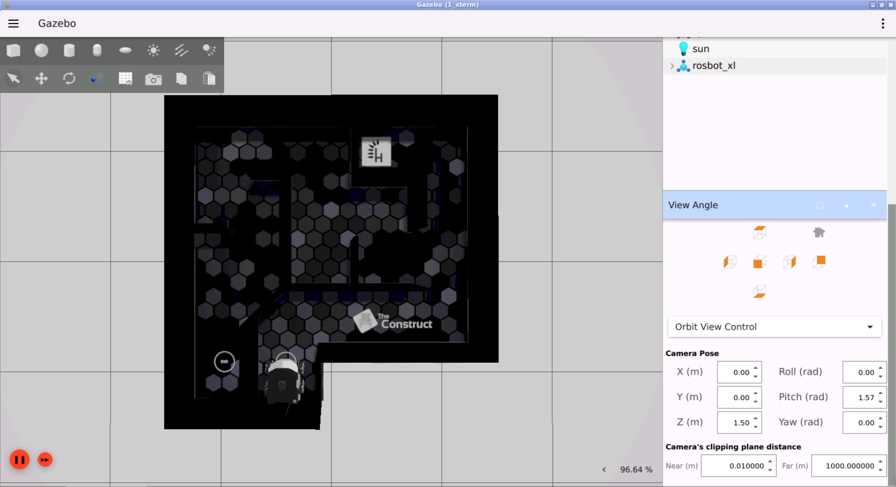

# Checkpoint 17 — PID Maze Solver

ROS 2 C++ **PID waypoint follower with reactive obstacle avoidance** for the **Husarion ROSBot XL** (4-wheel mecanum / holonomic). The node solves a fixed 14-waypoint maze in four switchable scenes (simulation, real CyberWorld, plus reverse variants of each), fusing a **3-DOF PID controller** on `(x, y, φ)` with a **2D laser-scan safety layer** that nudges the velocity command away from critical front/back/left/right obstacles and simultaneously re-anchors the target pose to preserve the planned path.

<p align="center">
  
</p>

## How It Works

<p align="center">
  
</p>

### Pose Acquisition

1. A `tf2_ros::TransformListener` pulls the `odom → base_link` transform on every `odomCallback` tick — translation feeds `(x, y)`, the quaternion is reduced to yaw via `tf2::impl::getYaw`
2. A `/scan_filtered` subscription caches the latest `sensor_msgs/LaserScan` ranges for the safety layer
3. `got_odom_` and a non-empty range buffer gate the first control cycle

### Control Cycle (`executeCallback`, 200 ms timer)

1. `paused_` gate — after each waypoint a 2 s zero-twist pause is enforced before advancing
2. Target pose updated as `target = current + waypoints_[target_wp_]` when a waypoint has just been reached (or on init)
3. Pose error `e = target − current`, with yaw wrapped into `[-π, π]`
4. **Two-stage waypoint arrival** — when `‖(ex, ey)‖ < 0.02 m`:
   - If `|eφ| > 0.02 rad`, run **angular PID only**: `ω = Kp·eφ + Kd·Δeφ + Ki·∫eφ`, publish with zero linear
   - Otherwise mark waypoint reached, advance `target_wp_`, start the 2 s pause. After the 14th waypoint the node calls `rclcpp::shutdown()`
5. Otherwise run **linear PID on `(ex, ey)`**: `V = Kp·e + Kd·(e − e_prev) + Ki·∫e` (component-wise integral clamps `±5.0`)
6. `recomputeTwist(V)` rotates the world-frame command into the body frame with `R(-φ)` (cos/−sin), since the robot is holonomic
7. `performObstacleAvoidance(V)` applies the laser safety layer (see below)
8. Final command is clamped to `max_lin_vel_ = 0.18 m/s` and published as `(v_x, v_y, ω = 0)` on `/cmd_vel`

### Reactive Obstacle Avoidance

`performObstacleAvoidance` samples four cardinal beams from the 720-ray scan:

- front `ranges[0]`, left `ranges[179]`, back `ranges[359]`, right `ranges[579]`
- valid range gate `[0.05, 5.0] m`, critical threshold `0.21 m`

Corrections:

| Condition | Velocity nudge | Target-pose nudge (rotated by `R(φ)`) |
|---|---|---|
| `left < 0.21` | `v_y -= 0.05` | `(0, -0.003)` |
| `right < 0.20` | `v_y += 0.05` | `(0, +0.003)` |
| `front < 0.20` | `v_x = -0.05` | `(-0.003, 0)` |
| `back < 0.23` | `v_x =  0.05` | `(+0.003, 0)` |

The target-pose nudge is critical: it re-centers the goal relative to the obstacle so the PID doesn't fight the safety layer on the next tick.

### PID Configuration

| Gain | Value |
|------|-------|
| `Kp` | `0.35`  |
| `Ki` | `0.005` |
| `Kd` | `0.32`  |
| Integral clamp `int_limit_` | `5.0` (per axis) |
| `max_lin_vel_` | `0.18 m/s` |
| `max_ang_vel_` | `0.5 rad/s` |
| Position arrival | `0.02 m` |
| Angular arrival | `0.02 rad` |

## Scene Switching

One executable, four scenes via CLI argument. Each scene loads a 14-waypoint YAML file from `share/pid_maze_solver/waypoints/`:

| `scene_number` | Waypoint file | Description |
|---|---|---|
| `1` | `waypoints_sim.yaml` | Simulation — forward traversal |
| `2` | `waypoints_real.yaml` | Real CyberWorld — forward |
| `3` | `reverse_waypoints_sim.yaml` | Simulation — reverse |
| `4` | `reverse_waypoints_real.yaml` | Real CyberWorld — reverse (default) |

YAML format (`pid_maze_solver.ros__parameters.waypoints_*`): a flat list of `14 × 3 = 42` floats in `[dx, dy, dφ]` order.

## ROS 2 Interface

| Name | Type | Description |
|---|---|---|
| `/odometry/filtered` | `nav_msgs/Odometry` (sub) | Triggers the TF lookup that feeds `(x, y, φ)` |
| `/scan_filtered` | `sensor_msgs/LaserScan` (sub) | Filtered 2D laser scan for the safety layer |
| `/cmd_vel` | `geometry_msgs/Twist` (pub) | Body-frame command (`v_x`, `v_y`, `ω`) |
| TF: `odom → base_link` | `geometry_msgs/TransformStamped` | Pose source via `tf2_ros::TransformListener` |

## Project Structure

```
pid_maze_solver/
├── src/
│   └── pid_maze_solver.cpp
├── include/
├── waypoints/
│   ├── waypoints_sim.yaml
│   ├── waypoints_real.yaml
│   ├── reverse_waypoints_sim.yaml
│   └── reverse_waypoints_real.yaml
├── media/
├── CMakeLists.txt
└── package.xml
```

## How to Use

### Prerequisites

- ROS 2 Humble
- Gazebo (bundled with the `rosbot_xl_gazebo` simulation and maze world)
- `eigen3`, `yaml-cpp`, `tf2`, `tf2_ros`, `nav_msgs`, `sensor_msgs`, `geometry_msgs`
- `rosbot_xl_ros` stack in the same workspace (description + controllers + EKF + laser filter)

### Build

```bash
cd ~/ros2_ws
colcon build --packages-select pid_maze_solver --symlink-install
source install/setup.bash
```

### Simulation — forward

```bash
# Terminal 1 — ROSBot XL + maze world in Gazebo
ros2 launch rosbot_xl_gazebo simulation.launch.py

# Terminal 2 — PID maze solver (scene 1 = sim forward)
ros2 run pid_maze_solver pid_maze_solver 1
```

### Simulation — reverse

```bash
ros2 run pid_maze_solver pid_maze_solver 3
```

### Real robot (CyberWorld)

```bash
ros2 run pid_maze_solver pid_maze_solver 2   # forward
ros2 run pid_maze_solver pid_maze_solver 4   # reverse (default)
```

### Sanity checks

```bash
ros2 topic echo /cmd_vel
ros2 topic echo /scan_filtered --once
ros2 run tf2_ros tf2_echo odom base_link
```

## Key Concepts Covered

- **3-DOF PID on `(x, y, φ)`** with per-axis integral wind-up clamp and discrete derivative
- **World → body frame rotation** via `R(-φ)` before publishing the holonomic command
- **Two-stage arrival** — position first, then angular-only PID to snap heading before advancing
- **TF-based pose acquisition** — `tf2_ros::TransformListener` pulling `odom → base_link` instead of reading pose directly from the odometry message
- **Reactive laser safety layer** — cardinal-beam sampling on a filtered 720-ray scan, velocity nudge + target re-anchor
- **Multi-scene deployment** — one executable reads a scene-specific YAML waypoint file at startup, handles sim/real/forward/reverse
- **MultiThreadedExecutor** so the 200 ms control timer, TF callbacks, odom and scan callbacks can all progress concurrently

## Technologies

- ROS 2 Humble
- C++ 17 (`rclcpp`, `tf2`, `tf2_ros`, `nav_msgs`, `sensor_msgs`, `geometry_msgs`)
- Eigen 3 (state vectors + rotation matrices)
- `yaml-cpp` (waypoint loading)
- Husarion ROSBot XL (4-wheel mecanum) + filtered 2D laser in Gazebo Sim + CyberWorld
