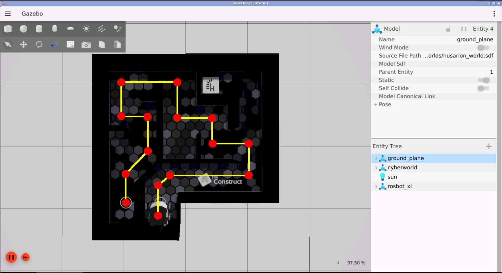
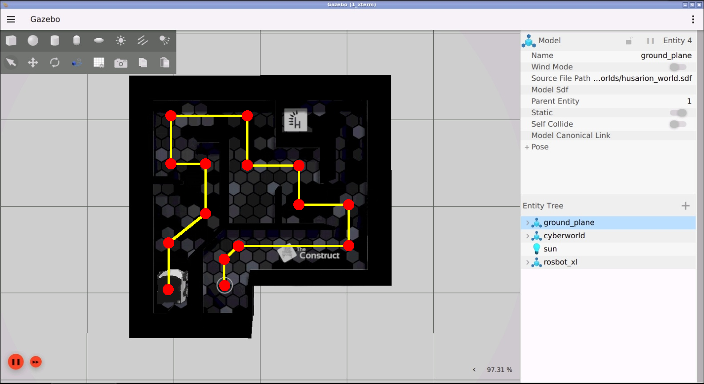
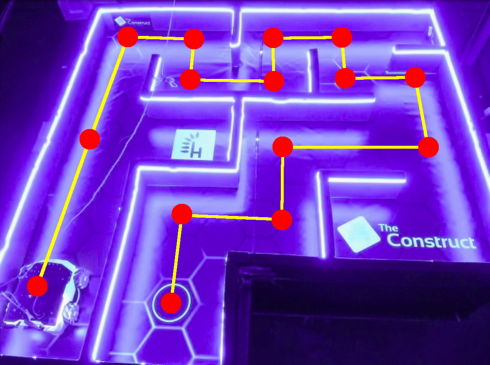
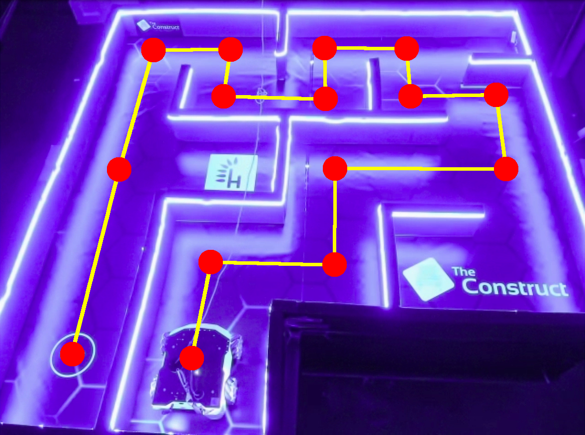

# Checkpoint 17 — PID Maze Solver

ROS 2 C++ **PID maze solver** for the **Husarion ROSBot XL** (4-wheel mecanum / holonomic). The node combines the distance and turn PID controllers into a single program that drives the robot through a hardcoded waypoint list, alternating between turn-to-heading and move-to-position states until the maze is solved. Includes a **laser-scan safety layer** for wall avoidance during the move state. Works against both the Gazebo maze world and the real CyberWorld ROSBot XL — the waypoint list is selected from a **scene number** passed as a CLI argument.

<p align="center">
  
</p>

## How It Works

<p align="center">
  
</p>

### Control Loop

1. A single-node executable `pid_maze_solver` subscribes to `/odometry/filtered` (`nav_msgs/Odometry`) and `/scan_filtered` (`sensor_msgs/LaserScan`), and publishes `geometry_msgs/Twist` on `/cmd_vel`
2. Pose `(x, y, φ)` is pulled from the `odom → base_link` TF via a `tf2_ros::TransformListener`; yaw is extracted with `tf2::impl::getYaw`
3. On construction it calls `select_waypoints(scene_number)` to load one of four 14-waypoint YAML files from `share/pid_maze_solver/waypoints/`
4. Per iteration (`200 ms` timer):
   - Pose error `e = target − current`, yaw wrapped into `[−π, π]`
   - If `‖(ex, ey)‖ ≥ 0.02 m` → run **linear PID on `(ex, ey)`** in the world frame, rotate into the body frame with `R(−φ)`, publish `(v_x, v_y, ω = 0)`
   - Else if `|eφ| ≥ 0.02 rad` → run **angular PID only**, publish `(0, 0, ω)` to snap the heading
   - Otherwise mark the waypoint reached, enforce a 2 s zero-twist pause, and advance to the next
5. Laser-scan safety layer samples four cardinal beams (front / left / back / right) and nudges both the velocity command **and** the target pose whenever a beam is inside `0.21 m`, so the PID doesn't fight the correction
6. After the 14th waypoint, the node calls `rclcpp::shutdown()`

### PID Configuration

| Gain | Value |
|------|-------|
| `Kp` | `0.35`  |
| `Ki` | `0.005` |
| `Kd` | `0.32`  |
| Integral clamp `int_limit_` | `5.0` (per axis) |
| Max linear speed `max_lin_vel_` | `0.18 m/s` |
| Max angular speed `max_ang_vel_` | `0.5 rad/s` |
| Position tolerance | `0.02 m` |
| Angular tolerance | `0.02 rad` |
| Critical laser distance | `0.21 m` |

## Waypoint Scenes

One executable, four scenes via CLI argument. Each scene loads a 14-waypoint YAML file of `[dx, dy, dφ]` triplets:

| `scene_number` | Waypoint file | Description |
|---|---|---|
| `1` | `waypoints_sim.yaml` | Simulation — forward traversal |
| `2` | `waypoints_real.yaml` | Real CyberWorld — forward |
| `3` | `reverse_waypoints_sim.yaml` | Simulation — reverse |
| `4` | `reverse_waypoints_real.yaml` | Real CyberWorld — reverse (default) |

### Forward — Simulation / CyberWorld

<p align="center">
  
</p>

<p align="center">
  
</p>

### Reverse — Simulation / CyberWorld

<p align="center">
  
</p>

<p align="center">
  
</p>

<p align="center">
  
</p>

## Real Robot Deployment (CyberWorld)

<p align="center">
  
</p>

<p align="center">
  
</p>

The same executable runs **unmodified** on the real Husarion ROSBot XL in The Construct's **CyberWorld** lab — only the scene number changes. Scenes `2` and `4` load hand-tuned waypoint files that account for the real maze's geometry:

1. The ROSBot XL real-robot stack (`rosbot_xl_ros` + EKF + `scan_filter_chain`) streams `/odometry/filtered` and `/scan_filtered` from CyberWorld — same topics the sim publishes
2. The `pid_maze_solver` node is launched locally with scene `2` (forward) or `4` (reverse, default):

   ```bash
   ros2 run pid_maze_solver pid_maze_solver 2   # forward run
   ros2 run pid_maze_solver pid_maze_solver 4   # reverse run
   ```
3. The reactive laser safety layer is **critical** on the real robot — real maze walls are not perfectly rectilinear, so the front / back / left / right beam sampling catches deviations the pure PID would miss
4. The 2 s inter-waypoint pause lets the real robot physically settle before the next segment — inertia is higher than in sim

### Sim ↔ real parity

| Concern | Simulation (scenes 1 / 3) | Real CyberWorld (scenes 2 / 4) |
|---|---|---|
| Feedback | TF `odom → base_link` | TF `odom → base_link` |
| Safety scan | `/scan_filtered` (Gazebo plugin) | `/scan_filtered` (physical Hokuyo + filter chain) |
| Waypoint file | `waypoints_sim.yaml`, `reverse_waypoints_sim.yaml` | `waypoints_real.yaml`, `reverse_waypoints_real.yaml` |
| PID gains | `Kp=0.35, Ki=0.005, Kd=0.32` | same (unchanged) |
| Tolerance | `0.02 m` / `0.02 rad` | `0.02 m` / `0.02 rad` |
| Clock | sim time | wall clock |
| Default scene | — | `4` (reverse CyberWorld) |

## ROS 2 Interface

| Name | Type | Description |
|---|---|---|
| `/odometry/filtered` | `nav_msgs/Odometry` (sub) | Triggers the TF lookup that feeds `(x, y, φ)` |
| `/scan_filtered` | `sensor_msgs/LaserScan` (sub) | Filtered 2D laser scan for the safety layer |
| `/cmd_vel` | `geometry_msgs/Twist` (pub) | Body-frame command (`v_x`, `v_y`, `ω`) |
| TF: `odom → base_link` | `geometry_msgs/TransformStamped` | Pose source via `tf2_ros::TransformListener` |

## Project Structure

```
pid_maze_solver/
├── src/
│   └── pid_maze_solver.cpp
├── include/
├── waypoints/
│   ├── waypoints_sim.yaml
│   ├── waypoints_real.yaml
│   ├── reverse_waypoints_sim.yaml
│   └── reverse_waypoints_real.yaml
├── media/
├── CMakeLists.txt
└── package.xml
```

## How to Use

### Prerequisites

- ROS 2 Humble
- Gazebo (bundled with the `rosbot_xl_gazebo` simulation and maze world)
- `eigen3`, `yaml-cpp`, `tf2`, `tf2_ros`, `nav_msgs`, `sensor_msgs`, `geometry_msgs`
- `rosbot_xl_ros` stack in the same workspace (description + controllers + EKF + laser filter)

### Build

```bash
cd ~/ros2_ws
colcon build --packages-select pid_maze_solver --symlink-install
source install/setup.bash
```

### Simulation — forward

```bash
# Terminal 1 — ROSBot XL + maze world in Gazebo
ros2 launch rosbot_xl_gazebo simulation.launch.py

# Terminal 2 — PID maze solver (scene 1 = sim forward)
ros2 run pid_maze_solver pid_maze_solver 1
```

### Simulation — reverse

```bash
ros2 run pid_maze_solver pid_maze_solver 3
```

### Real robot (CyberWorld)

```bash
ros2 run pid_maze_solver pid_maze_solver 2   # forward
ros2 run pid_maze_solver pid_maze_solver 4   # reverse (default)
```

### Sanity checks

```bash
ros2 topic echo /cmd_vel
ros2 topic echo /scan_filtered --once
ros2 run tf2_ros tf2_echo odom base_link
```

## Key Concepts Covered

- **Two-state PID solver**: turn-to-heading + move-to-position alternation with a shared arrival gate
- **3-DOF PID on `(x, y, φ)`** with per-axis integral wind-up clamp and discrete derivative
- **World → body frame rotation** via `R(−φ)` before publishing the holonomic command
- **TF-based pose acquisition** — `tf2_ros::TransformListener` pulling `odom → base_link` instead of reading pose directly from the odometry message
- **Reactive laser safety layer** — cardinal-beam sampling on a filtered 720-ray scan, velocity nudge + target re-anchor
- **Multi-scene deployment** — one executable reads a scene-specific YAML waypoint file at startup, handles sim / real / forward / reverse
- **MultiThreadedExecutor** so the control timer, TF callbacks, odom and scan callbacks can all progress concurrently

## Technologies

- ROS 2 Humble
- C++ 17 (`rclcpp`, `tf2`, `tf2_ros`, `nav_msgs`, `sensor_msgs`, `geometry_msgs`)
- Eigen 3 (state vectors + rotation matrices)
- `yaml-cpp` (waypoint loading)
- Husarion ROSBot XL (4-wheel mecanum) in Gazebo Sim + CyberWorld
